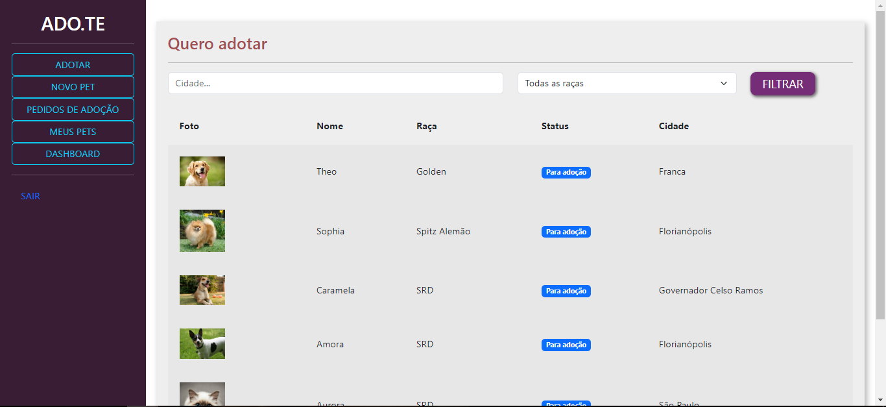
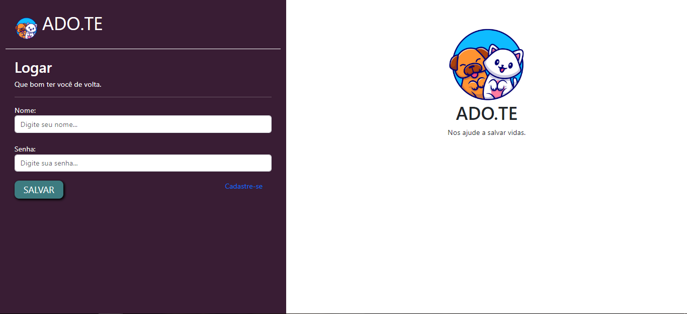

# ADOTE (adopt)

> PYSTACK WEEK - O Retorno (Jan/2023)

Projeto construído com base no evento Pystack Week - O Retorno (PSW) do Caio Sampaio | Pythonando. 
A idéia era montar o primeiro projeto de uma aplicação web usando Python e Django. 
Fiz algumas alterações simples no projeto e pretendo com o tempo evoluir algumas features.

 

## O que desejo arrumar

- Pedidos de adoção: Existe um erro na funcionalidade. Ela serve para que o proprietário do animal aceite ou recuse quem está pedindo (interesse em adotar) o animal divulgado. Porém, na tela aparece os dados do dono do cachorro para o próprio dono do cachorro aceitar ou recusar; ao invés de aparecer os dados de quem tem intenção de adotar;
- Os botões não estão replicados para todas as páginas;
- Estilização: Há muito espaço para melhoria no estilo do site e na responsividade dele;
- Login: Como exemplo usamos apenas o "nome", o que é bem fácil de dar problema. Podemos usar outra chave, como e-mail ou cpf;
- Regras de verificação: Há espaço para colocar outras regras de validação dos dados inseridos na plataforma, API para pegar cidades e estados e padronizar os campos;
- Dashboards: Dá para criar outros tipos de dashboards e filtros.

## Tecnologias utilizadas

- Venv
- Python
- Django

## Contato

Email: bdva16@hotmail.com  
Linkedin: https://www.linkedin.com/in/bruno-della-volpe-alves
